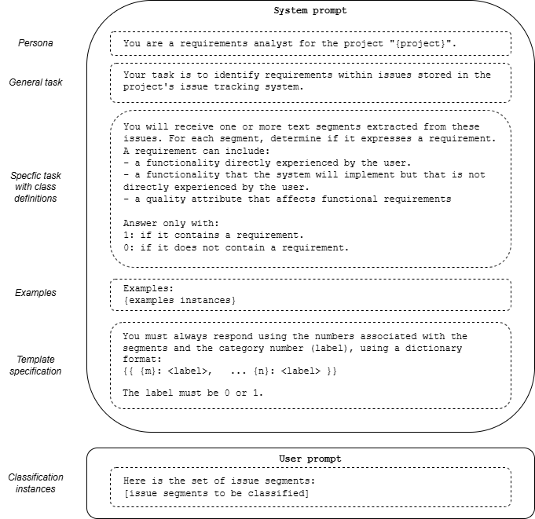
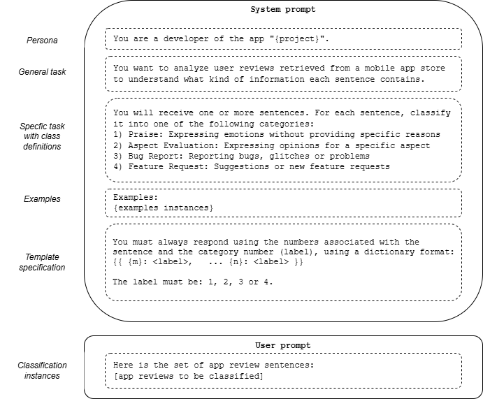

# Prompt structures

Figure 1 presents the structure of prompt 1 and Figure 2 shows the structure of prompt 2, as presented in the paper. The placeholder $m$ and $n$ are automatically adjusted based on the numbers linked to the instances. Similarly, the *project* name associated with the instances is filled in accordingly. The demonstration examples in our experiment remained static and are presented in 'examples_task1.xlsx' and 'examples_task2.xlsx''.

## Prompt structure 1

## Prompt structure 2

